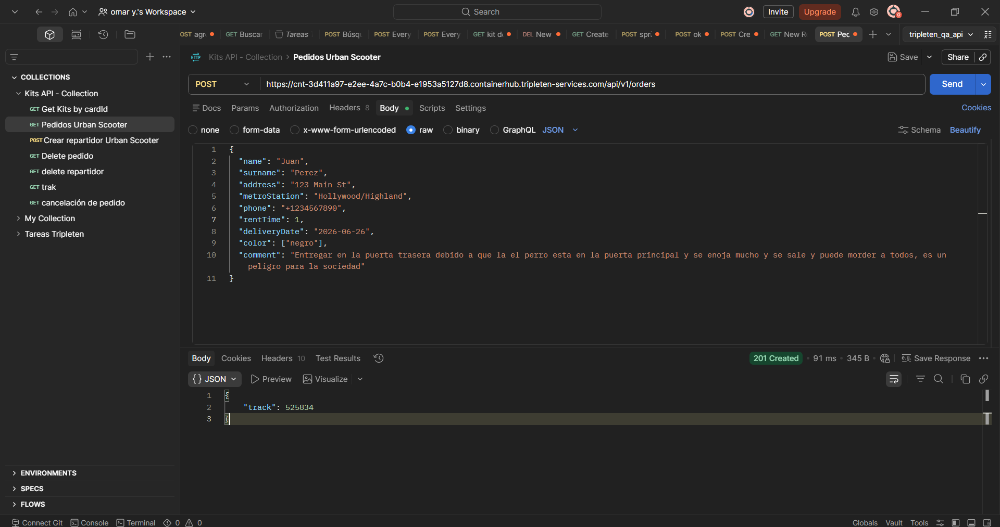
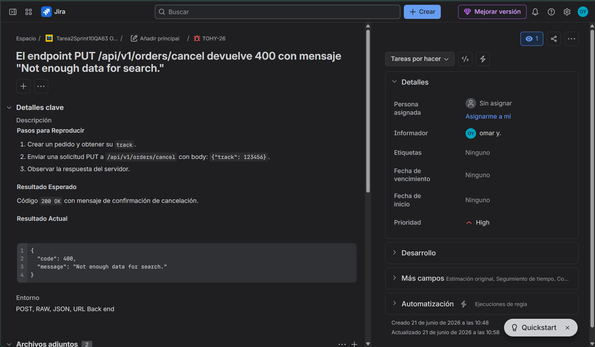

<!-- BANNER CON EFECTO ONDAS - AZUL/VERDE -->

  

<!-- EFECTO MÁQUINA DE ESCRIBIR -->

  

  
  # 👋 QA Tester Portfolio
  
  ## Omar Hernández Yebra
  
  omar.ye.omar@gmail.com  
    
   
  📱 52-477-694-1465

---

> ### 💡 *"I don't just test what a system does; I investigate what the system means to the people who use it."*

---

## 👋🏻 About Me

Hi, my name is **Omar Hernández Yebra**. After building a solid foundation in **History and Records Management**, I decided to pivot into technology, completing a rigorous Software QA Bootcamp at **TripleTen**. 

I am thrilled to have found a field where my deep passion for structure, research, and analysis can be fully utilized. Because of my background in history, I have a natural obsession with data integrity, documentation, and systematic order—qualities that seamlessly translate into my everyday QA practice.

Whether I am writing precise test cases, querying a database using **SQL**, or meticulously hunting down bugs, I approach software with the same critical eye I used to analyze historical records.

In this portfolio, I want to showcase my practical skills in both manual and automated testing. I am currently focused on advancing my knowledge in **Python + Selenium WebDriver (POM)** to build cleaner, more maintainable automation frameworks. I am highly adaptable, eager to learn, and ready to help remote teams release reliable, high-quality software.

---

## 🏢 My Experience

Completing my **QA Engineering program at TripleTen** allowed me to bridge the gap between abstract problem-solving and technical execution. During this intensive hands-on experience, I mastered:

- ✅ Creating comprehensive test documentation (test cases, bug reports, and checklists)
- ✅ Testing **REST APIs with Postman**
- ✅ Designing functional end-to-end automation scripts using **Python, PyTest, and Selenium WebDriver**

Additionally, my previous professional experience in **Records Management** played a vital role in shaping my QA mindset. In that field, I was responsible for overseeing the absolute accuracy, consistency, and classification of massive amounts of data.

This role taught me how to analyze complex systems from the ground up, handle edge cases where information could be corrupted, and communicate technical findings clearly to diverse teams.

---

## 🛠️ Tools & Technologies

### 🧪 Testing & Automation

### 🗄️ Databases & SQL

### 💻 Development & IDEs

### 📱 Mobile & Cross-Platform

### 🤖 AI Assistants

### 🗂️ Project Management & Comms

### 🖥️ Terminal & Tools

---

## 🗄️ SQL Skills & Operators

### Dominio de SQL - Nivel Intermedio

| 🔍 **Sintaxis y Orden de Ejecución** | 🆚 **Operadores de Comparación** | 🧠 **Operadores Lógicos** | 📊 **Funciones de Agregación** | 🔗 **Joins y Uniones** | 🛠️ **Otros** |
|--------------------------------------|----------------------------------|---------------------------|-------------------------------|------------------------|---------------|
| `SELECT` (*, DISTINCT, TOP)          | `=`  (Igual)                      | `AND`                     | `COUNT()`                     | `INNER JOIN`           | `AS` (Alias)  |
| `FROM`                               | `!=` / `<>` (Diferente)           | `OR`                      | `SUM()`                       | `LEFT JOIN`            | `UNION`       |
| `WHERE`                              | `>`  (Mayor que)                  | `NOT`                     | `AVG()`                       | `RIGHT JOIN`           | `LIMIT`       |
| `GROUP BY`                           | `<`  (Menor que)                  | `BETWEEN`                 | `MIN()`                       | `FULL JOIN`            | `OFFSET`      |
| `HAVING`                             | `>=` (Mayor o igual)              | `IN`                      | `MAX()`                       | `CROSS JOIN`           | `CASE`        |
| `ORDER BY` (ASC, DESC)               | `<=` (Menor o igual)              | `LIKE`                    | `GROUP_CONCAT()`              | `UNION`                | `COALESCE()`  |
| `UPDATE` (SET)                       | `!<` (No menor que)               | `IS NULL`                 | `ROUND()`                     | `EXCEPT`               | `NULLIF()`    |
| `ALTER TABLE` (ADD, DROP)            | `!>` (No mayor que)               | `IS NOT NULL`             | `CEILING()` / `FLOOR()`       | `INTERSECT`            | `CAST()`      |
| `INSERT INTO`                        | `BETWEEN` (Entre)                 | `EXISTS`                  | `DATEDIFF()`                  |                        | `CONVERT()`   |

---

### Ejemplo de Consulta Avanzada

SELECT 
    cabs.company_name,
    COUNT(trips.trip_id) AS trips_amount,
    AVG(trips.distance) AS avg_distance,
    MAX(trips.price) AS max_price
FROM cabs
INNER JOIN trips ON cabs.cab_id = trips.cab_id
WHERE trips.date >= '2024-01-01'
GROUP BY cabs.company_name
HAVING COUNT(trips.trip_id) > 100
ORDER BY trips_amount DESC
LIMIT 10;

---

## 💻 Technical Skills

| Área | Habilidad | Nivel |
|------|-----------|-------|
| 🧪 | Manual Testing | ████████████████░░░░ 80% |
| 🤖 | Automation (Python) | ██████████████░░░░░░ 70% |
| 🗄️ | SQL | ██████████████░░░░░░ 70% |
| 🔌 | API Testing | ████████████████░░░░ 80% |
| 📝 | Test Documentation | ██████████████████░░ 90% |
| 🔄 | Agile/Scrum | ████████████████░░░░ 80% |

---

## 📂 Proyectos Destacados

### 🤖 Proyecto 1: Automatización End-to-End - Urban Routes
**Repositorio**: [qa-project-Urban-Routes-es](https://github.com/OmarHY-lab/qa-project-Urban-Routes-es.git)

  

**Descripción**: Proyecto de automatización de pruebas end-to-end para la aplicación web de transporte Urban Routes, verificando el flujo completo desde la configuración de ruta hasta la reserva final.

**📌 Tecnologías**: `Python` `Selenium` `PyTest` `POM` `Git`

[🔗 Ver repositorio](https://github.com/OmarHY-lab/qa-project-Urban-Routes-es.git)

---

### 🚀 Proyecto 2: API Testing Framework - Urban Grocers
**Repositorio**: [qa-project-Urban-Grocers-app-es](https://github.com/OmarHY-lab/qa-project-Urban-Grocers-app-es.git)

  

**Descripción**: Framework de pruebas automatizadas de API desarrollado en Python y Pytest. Cubre la matriz de validación (límites, tipos de datos y parámetros requeridos) para el endpoint /api/v1/kits de Urban Grocers.

**📌 Tecnologías**: `Python` `PyTest` `API Testing` `Requests` `JSON`

[🔗 Ver repositorio](https://github.com/OmarHY-lab/qa-project-Urban-Grocers-app-es.git)

---

### 🧪 Proyecto 3: Pruebas Manuales - Mapa Interactivo Urban Routes
**Documentación**: [Google Sheets](https://docs.google.com/spreadsheets/d/1VKUDhj1QtbGdgjdT0z5RPOliXIab8OdL/edit?usp=sharing)

  

**Descripción**: Diseño y ejecución de pruebas manuales (QA) para la interfaz y usabilidad del mapa interactivo de Urban Routes. Aplicación de metodologías de prueba, diseño de casos de prueba y reporte de defectos.

**📌 Tecnologías**: `Manual Testing` `Test Design` `Bug Reporting` `Jira`

[📊 Ver casos de prueba](https://docs.google.com/spreadsheets/d/1VKUDhj1QtbGdgjdT0z5RPOliXIab8OdL/edit?usp=sharing)

---

### 📊 Proyecto 4: Técnicas de Caja Negra - Urban Routes
**Documentación**: [Google Sheets](https://docs.google.com/spreadsheets/d/1tBsV9ngR47QSXg0mQDZjPi6yv8U_U5EZ/edit?usp=sharing)

**Descripción**: Aplicación de técnicas de caja negra (Clases de Equivalencia y Análisis de Valores Límite) para la optimización de datos de prueba en Urban Routes.

**📌 Tecnologías**: `Black Box Testing` `Equivalence Partitioning` `Boundary Value Analysis`

[📊 Ver documentación](https://docs.google.com/spreadsheets/d/1tBsV9ngR47QSXg0mQDZjPi6yv8U_U5EZ/edit?usp=sharing)

---

### 🌐 Proyecto 5: Cross-Browser Testing - Urban Routes
**Documentación**: [Google Docs](https://docs.google.com/document/d/1XCsys6TYIb_UE24vEJEzKSCV-S0qREOP/edit?usp=sharing) | [Google Sheets](https://docs.google.com/spreadsheets/d/1D5rmEmyOV34mv1IVkQi6EApPiyiwLb3w/edit?usp=sharing)

**Descripción**: Pruebas de diseño Cross-Browser (Chrome/Firefox) y resoluciones dinámicas para Urban Routes. Creación de listas de comprobación, análisis de requisitos (zonas grises) y gestión de bugs en Jira.

**📌 Tecnologías**: `Cross-Browser Testing` `Chrome DevTools` `Jira` `Responsive Design`

[📄 Ver documentación](https://docs.google.com/document/d/1XCsys6TYIb_UE24vEJEzKSCV-S0qREOP/edit?usp=sharing) | [📊 Ver casos de prueba](https://docs.google.com/spreadsheets/d/1D5rmEmyOV34mv1IVkQi6EApPiyiwLb3w/edit?usp=sharing)

---

### ⚙️ Proyecto 6: API Manual Testing - Urban Grocers
**Documentación**: [Google Sheets](https://docs.google.com/spreadsheets/d/1OVvGYxBvVCb-I9u6IptsZzaChTR6MOXJjYw_irDH89w/edit?usp=sharing)

**Descripción**: Pruebas manuales de API (Caja Negra) para Urban Grocers. Validación de payloads JSON, análisis de códigos de estado HTTP (POST), control de lógica de negocio y reporte de bugs en Jira.

**📌 Tecnologías**: `Manual API Testing` `JSON` `HTTP Status Codes` `Jira`

[📊 Ver documentación](https://docs.google.com/spreadsheets/d/1OVvGYxBvVCb-I9u6IptsZzaChTR6MOXJjYw_irDH89w/edit?usp=sharing)

---

### 📱 Proyecto 7: Mobile Testing - Urban.Lunch
**Documentación**: [Google Sheets](https://docs.google.com/spreadsheets/d/16VUDJJh9gSyDbjO0UYOJ8DsuigxyTO_T/edit?usp=sharing)

**Descripción**: Pruebas funcionales y de UI para la aplicación móvil Urban.Lunch. Creación de listas de comprobación, análisis de zonas grises (casos límite), lógica de geolocalización y reporte de bugs en Jira.

**📌 Tecnologías**: `Mobile Testing` `Android Studio` `UI Testing` `Geolocation Testing`

[📊 Ver documentación](https://docs.google.com/spreadsheets/d/16VUDJJh9gSyDbjO0UYOJ8DsuigxyTO_T/edit?usp=sharing)

---

### 🖥️ Proyecto 8: SQL & Console Exercises
**Documentación**: [Google Docs](https://docs.google.com/document/d/1_Bkb4LVNnhID1ObZ3RzQZ2czEdTTMDtJ/edit?usp=sharing)

**Descripción**: Ejercicios prácticos sobre manejo de consola (logs), gestión de directorios y consultas SQL para análisis de datos.

**📌 Tecnologías**: `SQL` `Command Line` `Bash` `Log Analysis`

[📄 Ver documentación](https://docs.google.com/document/d/1_Bkb4LVNnhID1ObZ3RzQZ2czEdTTMDtJ/edit?usp=sharing)

---

### 🛴 Proyecto 9: Manual Testing Suite - Scooter Rental App
**Documentación**: [Google Sheets](https://docs.google.com/spreadsheets/d/1qtO6askxec24z_yxuVCRHIQu9faeTISu/edit?usp=sharing)

**Descripción**: Conjunto de pruebas manuales (Casos de prueba, informes de errores y matrices de validación) para una aplicación web y móvil de alquiler de scooters. Validación del flujo completo de pedidos, desde la creación por parte del cliente hasta la gestión por parte del repartidor.

**📌 Tecnologías**: `Manual Testing` `Test Cases` `Bug Reports` `Mobile Testing` `Web Testing`

[📊 Ver documentación](https://docs.google.com/spreadsheets/d/1qtO6askxec24z_yxuVCRHIQu9faeTISu/edit?usp=sharing)

---

## 📬 Contacto

📧 **Email**: omar.ye.omar@gmail.com  
📱 **Teléfono**: 52-477-694-1465  

---

  <i>"Quality is not an act, it is a habit." - Aristotle</i>

